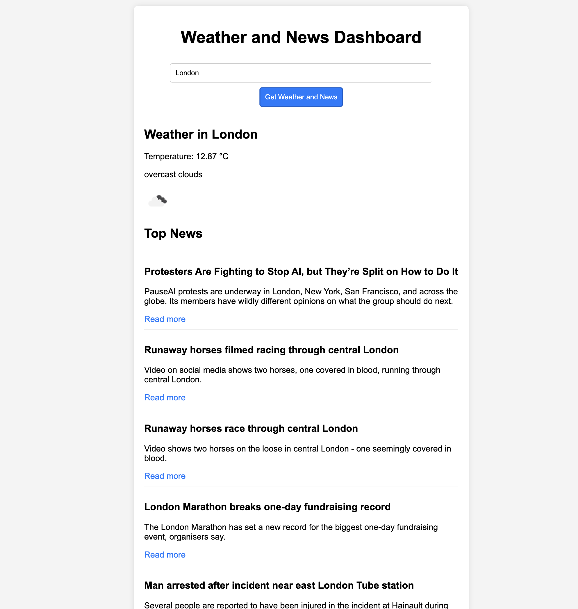

 Wetter-App

# Aufgabe: Wetter- und Nachrichten-Dashboard

#### Ziel
**Erstelle eine Webanwendung, die das aktuelle Wetter und die wichtigsten Nachrichtenüberschriften für eine vom Benutzer angegebene Stadt anzeigt. Die Anwendung soll Daten von zwei verschiedenen APIs abrufen: einer Wetter-API und einer Nachrichten-API.**

### Anforderungen

1. **Benutzereingabe:**

* Ein Texteingabefeld, in das der Benutzer den Namen einer Stadt eingeben kann. Ein Button, um den Datenabruf für die angegebene Stadt zu starten.

2. **Wetterdaten:**

* Verwende die OpenWeatherMap API, um das aktuelle Wetter für die angegebene Stadt abzurufen. Zeige den Stadtnamen, die Temperatur, die Wetterbeschreibung und ein Symbol, das das Wetter darstellt, an.
* https://openweathermap.org/api

3. **Nachrichtendaten:**

* Verwende die NewsAPI, um die wichtigsten Nachrichtenüberschriften für die angegebene Stadt abzurufen. Zeige die Nachrichtenüberschriften an, jede mit einem Titel, einer Beschreibung und einem Link zum vollständigen Artikel.
* https://newsapi.org/

4. **Fehlerbehandlung:**

* Zeige geeignete Fehlermeldungen an, wenn die Stadt nicht gefunden wird oder wenn es Probleme mit den API-Anfragen gibt.
* (Try, catch...)

5. **Styling:**

* Füge grundlegende CSS-Styling hinzu, um die Anwendung optisch ansprechend zu gestalten.
* (Gerne Frameworks(Bootstrap,etc...))

